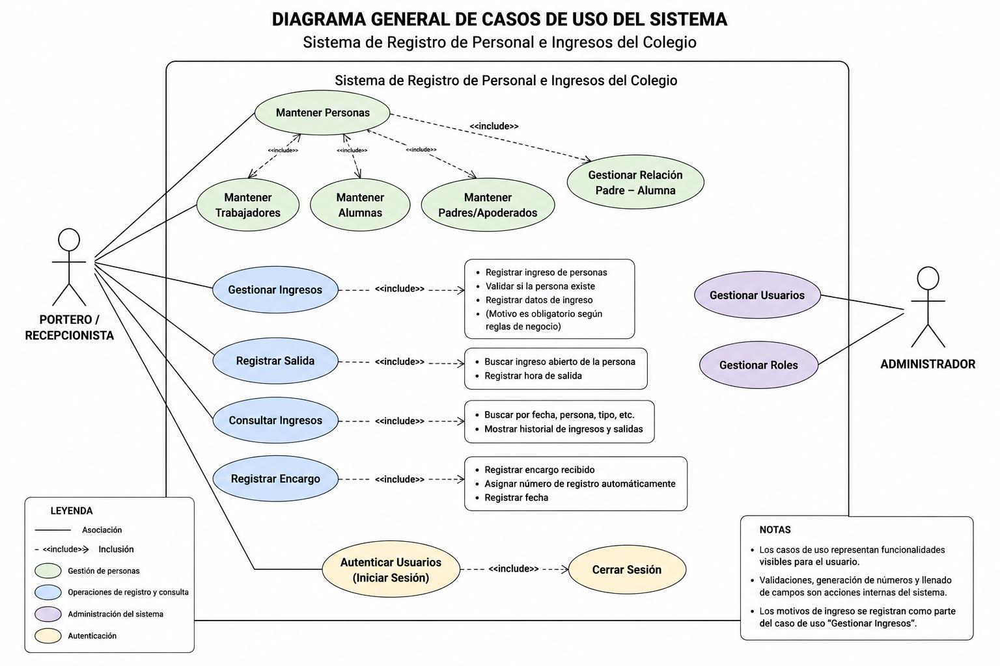
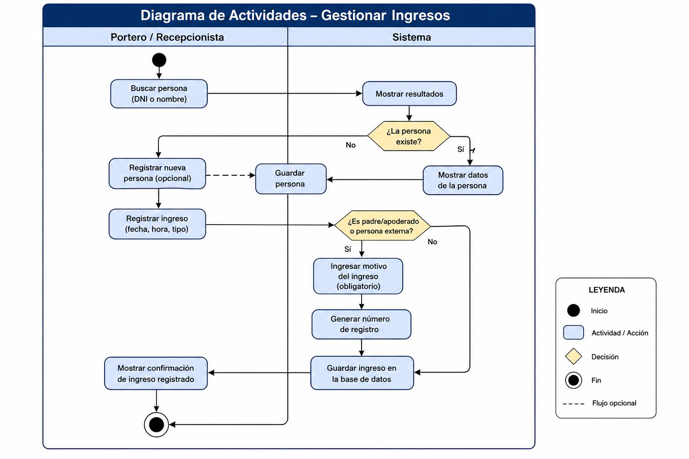
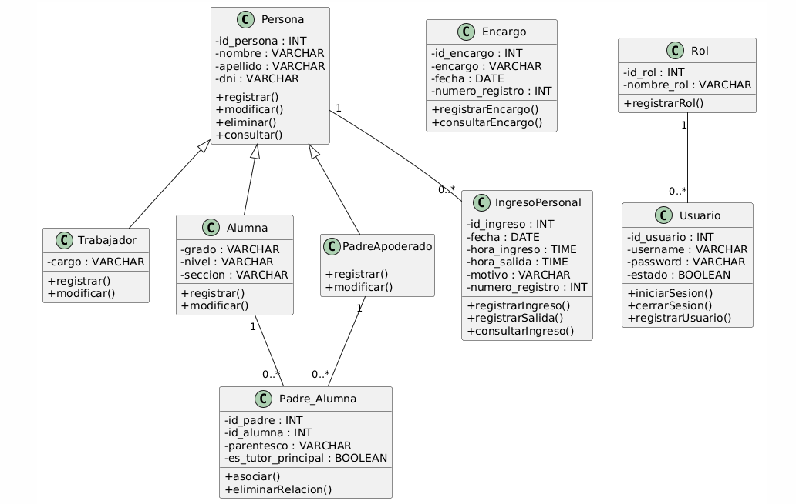
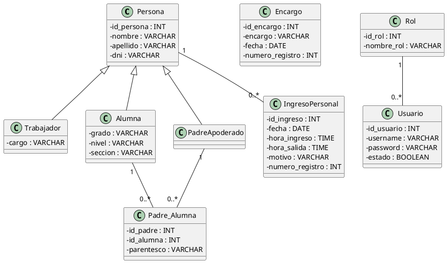
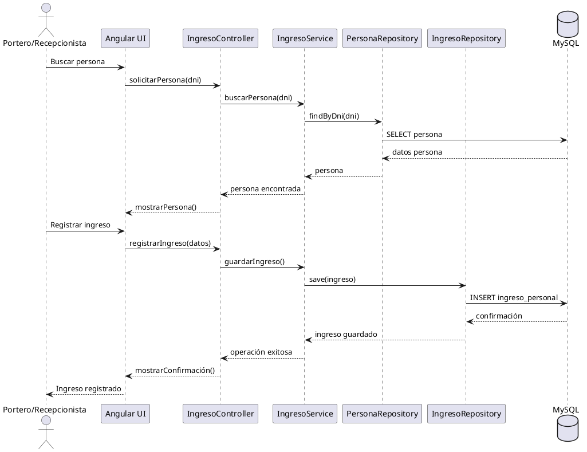

# Documentación de Análisis y Diseño

**Sistema de Registro de Personal e Ingresos del Colegio**

| Campo | Detalle |
|---|---|
| Proyecto | Sistema de registro de personal e ingresos del colegio |
| Enfoque | Análisis y diseño de software |
| Alcance | Negocio, requerimientos, casos de uso, modelado de datos y UML |

> Este documento consolida el análisis y diseño del sistema **antes y durante** su implementación. Se organiza desde el análisis del negocio hasta el diseño lógico y UML, con el fin de tener una base clara para ajustar la aplicación y su modelo de datos.

---

## 1. Introducción

Este documento consolida la documentación elaborada para el proyecto de registro de personal e ingresos del colegio. Se organiza desde el análisis del negocio hasta el diseño lógico y UML, con el fin de tener una base clara para ajustar la aplicación y su modelo de datos.

## 2. Objetivo del sistema

Desarrollar un sistema web que permita gestionar y controlar el ingreso, salida y registro de personas dentro de una institución educativa, de forma segura, organizada y rápida.

## 3. Alcance del sistema

- Registrar personas relacionadas con la institución.
- Gestionar ingresos y salidas de personal, padres/apoderados y personas externas.
- Consultar historial de ingresos.
- Registrar encargos de forma simple y rápida.
- Gestionar la relación padre-apoderado - alumna.
- Administrar usuarios y roles del sistema.

## 4. Situación actual y situación propuesta

**Situación actual.** El control de ingreso y salida se realiza de manera manual o con registros poco estructurados, lo que genera demoras, dificultad para consultar información histórica y riesgo de pérdida de datos.

**Situación propuesta.** Se propone un sistema web que sistematice el control de accesos y registros, reduzca el tiempo de atención, mejore la trazabilidad y centralice la información.

## 5. Actores del negocio

| Actor | Descripción |
|---|---|
| Portero / Recepcionista | Actor principal que registra personas, ingresos, salidas, encargos y consultas. |
| Trabajador | Personal del colegio que puede ser registrado y relacionado con ingresos. |
| Padre / Apoderado | Persona que ingresa o se relaciona con alumnas. |
| Alumna | Estudiante relacionada con padres/apoderados y con salidas controladas. |
| Persona externa | Visitante ajeno al colegio que debe ser registrado antes de ingresar. |

## 6. Procesos de negocio

| Proceso | Descripción resumida |
|---|---|
| Registrar personas | Registrar datos base de trabajadores, alumnas, padres/apoderados y externos. |
| Registrar ingreso | Registrar fecha, hora, motivo y número de registro del ingreso. |
| Registrar salida | Actualizar hora de salida cuando la persona abandona el colegio. |
| Consultar ingresos | Buscar registros por fecha, nombre o documento. |
| Registrar encargo | Guardar encargos o recados de forma rápida. |
| Gestionar salida de alumnas | Registrar la salida de una alumna y su relación con un responsable. |

## 7. Reglas de negocio

- Ninguna persona externa puede ingresar sin estar registrada previamente.
- Los padres/apoderados y personas externas deben registrar motivo de ingreso.
- Los trabajadores pueden ingresar sin motivo obligatorio.
- La hora de salida puede permanecer vacía mientras el registro siga activo.
- El encargo se mantiene simple y no se relaciona con otras entidades para agilizar el uso.

## 8. Requerimientos y requisitos

**Requerimientos funcionales principales:**

| Código | Requerimiento |
|---|---|
| RF01 | Registrar personas relacionadas con la institución. |
| RF02 | Registrar ingresos de personas al colegio. |
| RF03 | Consultar registros de ingresos. |
| RF04 | Generar reportes o visualizaciones históricas. |
| RF05 | Registrar encargos o recados. |
| RF06 | Gestionar la salida de alumnas. |
| RF07 | Autenticar usuarios y controlar acceso. |
| RF08 | Administrar usuarios y roles. |

**Requerimientos no funcionales principales:**

| Código | Requerimiento no funcional |
|---|---|
| RNF01 | El sistema debe ser fácil de usar para el personal de portería. |
| RNF02 | Las operaciones deben responder en tiempos adecuados. |
| RNF03 | Las contraseñas deben almacenarse cifradas. |
| RNF04 | El sistema debe mantener integridad y consistencia de los datos. |
| RNF05 | La interfaz debe ser clara y simple. |

## 9. Casos de uso del negocio

| Código | Caso de uso | Actor principal | Precondición | Resultado |
|---|---|---|---|---|
| CUN01 | Registrar personas | Portero | Que la persona sea nueva o editable | Registro guardado |
| CUN02 | Registrar ingreso | Portero | Persona registrada | Ingreso registrado |
| CUN03 | Consultar ingresos | Portero | Existencia de registros | Lista de ingresos mostrada |
| CUN04 | Registrar encargo | Portero | Usuario autenticado | Encargo almacenado |
| CUN05 | Gestionar salida de alumna | Portero | Alumna registrada | Salida registrada |

## 10. Casos de uso del sistema

| Código | Caso de uso | Descripción |
|---|---|---|
| CUS01 | Mantener Personas | CRUD de personas base |
| CUS02 | Mantener Trabajadores | Registrar cargo del trabajador |
| CUS03 | Mantener Alumnas | Registrar grado, nivel y sección |
| CUS04 | Mantener Padres/Apoderados | Registrar padres o apoderados |
| CUS05 | Gestionar Relación Padre-Alumna | Relacionar padre/apoderado con alumna |
| CUS06 | Gestionar Ingresos | Registrar ingreso con fecha, hora y motivo |
| CUS07 | Registrar Salida | Actualizar hora de salida |
| CUS08 | Consultar Ingresos | Filtrar y visualizar registros |
| CUS09 | Registrar Encargo | Guardar encargo simple |
| CUS10 | Autenticar Usuarios | Validar acceso al sistema |
| CUS11 | Gestionar Usuarios | Administrar cuentas y roles |

## 11. Especificación de casos de uso del sistema (ECUS)

Se documentan los casos de uso del sistema más importantes con una descripción resumida de propósito, actor principal y flujo básico.

| Código | Caso de uso | Actor principal | Propósito | Flujo básico |
|---|---|---|---|---|
| ECUS-01 | Mantener Personas | Portero / Recepcionista | Registrar, actualizar, consultar o eliminar personas. | Inicia sesión, abre el módulo y guarda los datos de la persona. |
| ECUS-02 | Mantener Trabajadores | Portero / Recepcionista | Registrar cargo y datos específicos del trabajador. | Selecciona la persona y registra el cargo. |
| ECUS-03 | Mantener Alumnas | Portero / Recepcionista | Registrar grado, nivel y sección de la alumna. | Selecciona la persona y completa los datos académicos. |
| ECUS-04 | Mantener Padres/Apoderados | Portero / Recepcionista | Registrar a padres o apoderados. | Selecciona la persona y la guarda como padre/apoderado. |
| ECUS-05 | Gestionar Relación Padre-Alumna | Portero / Recepcionista | Relacionar padre/apoderado con alumna. | Selecciona ambos registros y guarda la relación. |
| ECUS-06 | Gestionar Ingresos | Portero / Recepcionista | Registrar ingreso con fecha, hora, motivo y número de registro. | Busca la persona, registra el ingreso y guarda. |
| ECUS-07 | Registrar Salida | Portero / Recepcionista | Actualizar la hora de salida de un ingreso activo. | Busca el ingreso y registra la salida. |
| ECUS-08 | Consultar Ingresos | Portero / Recepcionista | Filtrar y revisar historial de registros. | Ingresa criterios de búsqueda y visualiza resultados. |
| ECUS-09 | Registrar Encargo | Portero / Recepcionista | Guardar encargos o recados de manera rápida. | Ingresa la descripción y fecha del encargo. |
| ECUS-10 | Autenticar Usuarios | Usuario del sistema | Validar credenciales de acceso. | Ingresa usuario y contraseña; el sistema concede acceso. |
| ECUS-11 | Gestionar Usuarios | Administrador | Administrar cuentas y roles. | Registra, actualiza o elimina cuentas. |

## 12. Modelo conceptual de entidades

El modelo conceptual representa las entidades principales del sistema y sus relaciones a nivel lógico.

| Entidad | Descripción |
|---|---|
| Persona | Entidad base que almacena datos generales: id_persona, nombre, apellido y dni. |
| Trabajador | Especialización de Persona que agrega el atributo cargo. |
| Alumna | Especialización de Persona que agrega grado, nivel y sección. |
| PadreApoderado | Especialización de Persona para padres o apoderados. |
| Padre_Alumna | Tabla/entidad intermedia que representa la relación entre padres/apoderados y alumnas. |
| IngresoPersonal | Registro de ingreso y salida con fecha, hora_ingreso, hora_salida, motivo y numero_registro. |
| Encargo | Registro simple de encargos o recados, sin relaciones adicionales. |
| Usuario | Cuenta de acceso al sistema con username, password, estado y rol. |
| Rol | Define permisos dentro del sistema. |

**Relaciones conceptuales:**

- Persona 1:1 Trabajador
- Persona 1:1 Alumna
- Persona 1:1 PadreApoderado
- PadreApoderado N:M Alumna mediante Padre_Alumna
- Persona 1:N IngresoPersonal
- Rol 1:N Usuario

## 13. Modelo relacional

```
PERSONA
  id_persona   INT PK AUTO_INCREMENT
  nombre       VARCHAR(100) NOT NULL
  apellido     VARCHAR(100) NOT NULL
  dni          VARCHAR(15) UNIQUE

TRABAJADOR
  id_persona   INT PK/FK -> PERSONA(id_persona)
  cargo        VARCHAR(100) NOT NULL

ALUMNA
  id_persona   INT PK/FK -> PERSONA(id_persona)
  grado        VARCHAR(20) NOT NULL
  nivel        VARCHAR(50) NOT NULL
  seccion      VARCHAR(10) NOT NULL

PADRE_APODERADO
  id_persona   INT PK/FK -> PERSONA(id_persona)

PADRE_ALUMNA
  id_padre     INT PK/FK -> PADRE_APODERADO(id_persona)
  id_alumna    INT PK/FK -> ALUMNA(id_persona)
  parentesco   VARCHAR(50) NOT NULL
  es_tutor_principal BOOLEAN DEFAULT FALSE

INGRESO_PERSONAL
  id_ingreso   INT PK AUTO_INCREMENT
  id_persona   INT FK -> PERSONA(id_persona)
  fecha        DATE NOT NULL
  hora_ingreso TIME NOT NULL
  hora_salida  TIME NULL
  motivo       VARCHAR(255) NULL
  numero_registro INT NOT NULL

ENCARGO
  id_encargo   INT PK AUTO_INCREMENT
  encargo      VARCHAR(255) NOT NULL
  fecha        DATE NOT NULL
  numero_registro INT NOT NULL

ROL
  id_rol       INT PK AUTO_INCREMENT
  nombre_rol   VARCHAR(50) UNIQUE NOT NULL

USUARIO
  id_usuario   INT PK AUTO_INCREMENT
  username     VARCHAR(100) UNIQUE NOT NULL
  password     VARCHAR(255) NOT NULL
  estado       BOOLEAN NOT NULL
  id_rol       INT FK -> ROL(id_rol)
```

**Observaciones de negocio:**

- El motivo de ingreso es obligatorio para padres/apoderados y personas externas.
- La hora de salida puede quedar vacía mientras el registro siga activo.
- El módulo de encargo se mantiene deliberadamente simple para agilizar el trabajo de portería.

## 14. Normalización de la base de datos

La normalización se aplicó para reducir redundancia, evitar inconsistencias y organizar la información correctamente.

| Forma normal | Idea simple |
|---|---|
| 1FN | Cada campo almacena un solo valor. No se guardan listas dentro de una celda. |
| 2FN | Los atributos dependen completamente de su clave primaria. Los datos específicos se separan en tablas distintas. |
| 3FN | Cada atributo pertenece a la entidad adecuada y no depende de datos no clave. |

**Ejemplo sencillo:** si una alumna y su padre se guardaran en una sola tabla, aparecerían muchos campos repetidos y datos mezclados. Al separar Persona, Alumna, PadreApoderado y la tabla Padre_Alumna, la información se organiza mejor y se evita duplicidad.

**Conclusión práctica:**

- Persona guarda los datos comunes.
- Trabajador y Alumna guardan solo lo específico.
- Padre_Alumna guarda la relación entre ambos.
- IngresoPersonal y Encargo se mantienen simples para agilizar el registro.

## 15. Diagramas UML desarrollados

Se desarrollaron diagramas de casos de uso, actividades, clases y secuencia como apoyo al diseño del sistema.

### 15.1 Diagrama general de casos de uso



El diagrama general muestra las funcionalidades principales: mantener personas, gestionar ingresos, consultar ingresos, registrar encargos, gestionar usuarios y autenticación.

### 15.2 Diagrama de actividades: gestionar ingresos



Este diagrama representa el flujo operativo para buscar una persona, registrar el ingreso y almacenar el registro.

### 15.3 Diagramas de secuencia



| Caso | Flujo resumido |
|---|---|
| Gestionar ingresos | Portero -> Angular UI -> Controller -> Service -> Repository -> MySQL |
| Registrar personas | Portero -> Angular UI -> Controller -> Service -> Repository -> MySQL |
| Registrar salida | Portero -> Angular UI -> Controller -> Service -> Repository -> MySQL |
| Registrar encargo | Portero -> Angular UI -> Controller -> Service -> Repository -> MySQL |

## 16. Código PlantUML de referencia

Para facilitar el redibujo de los diagramas en otras herramientas, se incluye el código PlantUML base.

### 16.1 Diagrama de clases



### 16.2 Diagrama de secuencia: gestionar ingresos


